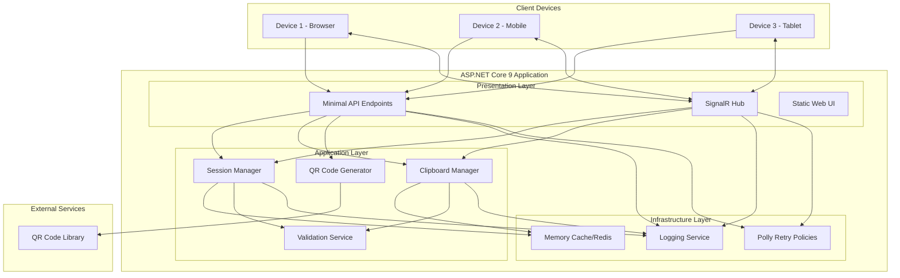

# Design - Distributed QR Clipboard System

## Technology Stack

### Backend
- **Framework**: ASP.NET Core 9 Minimal API
- **Language**: C# 13
- **Real-time Communication**: SignalR
- **QR Code Generation**: QRCoder or similar library
- **Retry Logic**: Polly
- **Testing**: xUnit, Moq, FluentAssertions
- **Logging**: ILogger with Serilog

### Frontend
- **Framework**: Vanilla JavaScript with modern ES6+ features
- **CSS**: Modern CSS with CSS Grid/Flexbox
- **QR Scanner**: Html5-qrcode library
- **Real-time**: SignalR JavaScript client

### Infrastructure
- **Hosting**: Azure App Service or similar
- **Storage**: In-memory with Redis for production scaling
- **Security**: HTTPS, CORS configuration

## Non-Functional Requirements

### Performance
- **Response Time**: API endpoints < 200ms
- **Page Load**: Initial load < 3 seconds
- **Concurrent Sessions**: Support 100+ concurrent sessions
- **Memory Usage**: Efficient session cleanup and garbage collection

### Scalability
- **Horizontal Scaling**: Stateless design with external session storage
- **Load Balancing**: Support for multiple instance deployment
- **Resource Management**: Automatic session cleanup and memory management

### Security
- **Session Security**: Cryptographically secure session IDs (GUID or better)
- **Data Protection**: No persistent storage of clipboard content
- **Network Security**: HTTPS enforcement, CORS policies
- **Input Validation**: Sanitization and length limits

### Reliability
- **Error Handling**: Graceful degradation and user-friendly messages
- **Retry Logic**: Exponential backoff for network operations
- **Connection Management**: Automatic reconnection for SignalR
- **Session Management**: Automatic cleanup and expiry

## Architecture Diagram



## Language and Code Instructions

### C# 13 Features to Use
- **Primary constructors** for dependency injection
- **Required members** for essential properties
- **Init-only properties** for immutable objects
- **Records** for data transfer objects
- **Pattern matching** for control flow
- **Nullable reference types** enabled globally
- **File-scoped namespaces** throughout
- **Global using statements** for common imports

### SOLID Principles Implementation
- **Single Responsibility**: Separate services for session, clipboard, QR generation
- **Open/Closed**: Interface-based design for extensibility
- **Liskov Substitution**: Proper inheritance hierarchies
- **Interface Segregation**: Focused interfaces for each concern
- **Dependency Inversion**: Dependency injection throughout

### Code Quality Standards
- **Immutability**: Prefer readonly and init-only properties
- **Null Safety**: No nullability warnings
- **Error Handling**: Try-catch with meaningful messages
- **Async/Await**: Proper async patterns throughout
- **Resource Management**: Using statements and proper disposal

## Data Transfer Objects

### Session-Related DTOs

```csharp
public sealed record SessionInfo(
    string SessionId,
    DateTime CreatedAt,
    DateTime ExpiresAt,
    int ConnectedDevices
);

public sealed record CreateSessionRequest;

public sealed record CreateSessionResponse(
    string SessionId,
    string QrCodeData,
    string QrCodeImageBase64
);

public sealed record JoinSessionRequest(
    string SessionId
);

public sealed record JoinSessionResponse(
    bool Success,
    string? ErrorMessage,
    SessionInfo? SessionInfo
);
```

### Clipboard-Related DTOs

```csharp
public sealed record ClipboardContent(
    string Content,
    DateTime Timestamp,
    string DeviceId
);

public sealed record CopyToClipboardRequest(
    string SessionId,
    string Content,
    string DeviceId
);

public sealed record CopyToClipboardResponse(
    bool Success,
    string? ErrorMessage,
    DateTime? Timestamp
);

public sealed record GetClipboardRequest(
    string SessionId
);

public sealed record GetClipboardResponse(
    bool Success,
    string? ErrorMessage,
    ClipboardContent? Content
);
```

### Real-time Event DTOs

```csharp
public sealed record ClipboardUpdatedEvent(
    string SessionId,
    ClipboardContent Content
);

public sealed record DeviceJoinedEvent(
    string SessionId,
    string DeviceId,
    int TotalDevices
);

public sealed record DeviceLeftEvent(
    string SessionId,
    string DeviceId,
    int TotalDevices
);
```

## Solution Architecture Instructions

### Project Structure
```
src/
├── DistributedQRClipboard.Api/          # Main API project
│   ├── Program.cs                       # Application entry point
│   ├── Endpoints/                       # Minimal API endpoints
│   ├── Hubs/                           # SignalR hubs
│   ├── Models/                         # DTOs and models
│   └── wwwroot/                        # Static web content
├── DistributedQRClipboard.Core/         # Business logic
│   ├── Interfaces/                     # Service interfaces
│   ├── Services/                       # Business services
│   ├── Models/                         # Domain models
│   └── Exceptions/                     # Custom exceptions
├── DistributedQRClipboard.Infrastructure/ # Infrastructure layer
│   ├── Caching/                        # Caching implementations
│   ├── QrCode/                         # QR code generation
│   └── Configuration/                  # Configuration extensions
└── DistributedQRClipboard.Tests/        # Unit tests
    ├── Unit/                           # Unit tests
    ├── Integration/                    # Integration tests
    └── Fixtures/                       # Test fixtures
```

### Dependency Injection Configuration
```csharp
// Register core services
builder.Services.AddScoped<ISessionManager, SessionManager>();
builder.Services.AddScoped<IClipboardManager, ClipboardManager>();
builder.Services.AddScoped<IQrCodeGenerator, QrCodeGenerator>();
builder.Services.AddScoped<IValidationService, ValidationService>();

// Register infrastructure
builder.Services.AddMemoryCache();
builder.Services.AddSingleton<ICacheService, MemoryCacheService>();

// Register Polly policies
builder.Services.AddResiliencePipeline("default", builder => {
    builder.AddRetry(new RetryStrategyOptions
    {
        ShouldHandle = new PredicateBuilder().Handle<Exception>(),
        MaxRetryAttempts = 3,
        Delay = TimeSpan.FromSeconds(1),
        BackoffType = DelayBackoffType.Exponential
    });
});
```

### API Endpoint Patterns
```csharp
// Session endpoints
app.MapPost("/api/sessions", CreateSession);
app.MapPost("/api/sessions/{sessionId}/join", JoinSession);
app.MapGet("/api/sessions/{sessionId}", GetSession);

// Clipboard endpoints
app.MapPost("/api/sessions/{sessionId}/clipboard", CopyToClipboard);
app.MapGet("/api/sessions/{sessionId}/clipboard", GetClipboard);

// Static file serving
app.UseDefaultFiles();
app.UseStaticFiles();
```

### SignalR Hub Design
```csharp
public sealed class ClipboardHub : Hub
{
    public async Task JoinSession(string sessionId) { }
    public async Task LeaveSession(string sessionId) { }
    public override async Task OnDisconnectedAsync(Exception? exception) { }
}
```

### Error Handling Strategy
- **API Level**: Global exception middleware
- **Service Level**: Try-catch with custom exceptions
- **Client Level**: User-friendly error messages
- **Logging**: Structured logging with correlation IDs

### Testing Strategy
- **Unit Tests**: All business logic services
- **Integration Tests**: API endpoints and SignalR hubs
- **End-to-End Tests**: Critical user journeys
- **Performance Tests**: Load testing for concurrent sessions

### Security Considerations
- **Session ID Generation**: Cryptographically secure random values
- **Input Validation**: Length limits and sanitization
- **Rate Limiting**: Prevent abuse of copy operations
- **CORS Configuration**: Restrict to necessary origins
- **HTTPS Enforcement**: All communications encrypted

### Performance Optimizations
- **Connection Pooling**: Efficient SignalR connections
- **Memory Management**: Automatic session cleanup
- **Caching Strategy**: In-memory with Redis fallback
- **Compression**: Response compression for large payloads
- **CDN Integration**: Static asset delivery optimization
